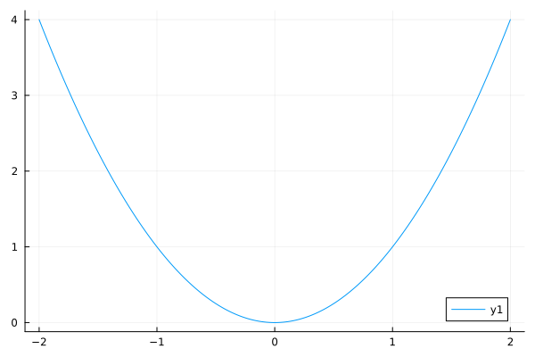
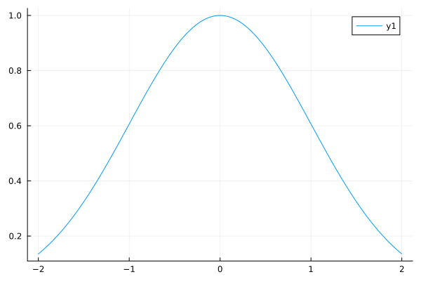
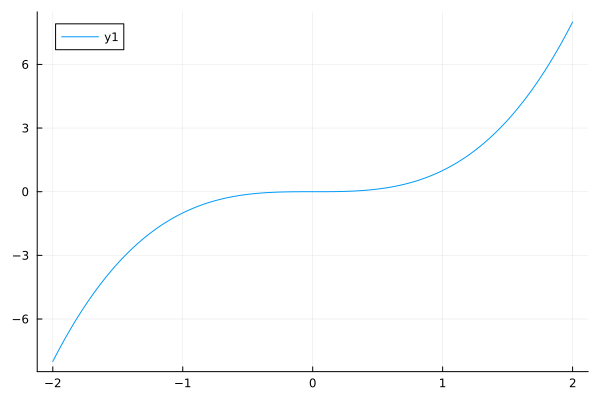
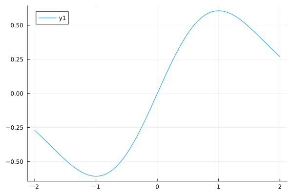

Let A and B be sets. A function from A to B is a deterministic rule that, given an element of A as input, provides an 
element of B as an output. That is, a function from A to B is a machine that takes an x in A and "maps" it to some y in 
B. Different x's can map to the same y, but each x only maps to one y. Here A is called the domain and B is called the 
target. The notation $f : A \to B$ says that f is a function mapping A into B. The range of f is 
$\lbrace y \in B : f(x) = y \text{ for some } x \in A \rbrace$.

It is important to distinguish between f (the function) and f(x) (the value of the function when evaluated at x). That 
is, f is a rule, while f(x) is a number for each number x. The function g given by $g(x) = e^{-{x^2} / 2}$ is exactly 
the same as the function g given by $g(t) = e^{-{t^2} / 2}$. what matters is the rule, not the name we use for the input.
For this example, the rule is that x gets mapped to $e^{-{x^2}$ this rule is also denoted by $x \mapsto e^{-{x^2} / 2}$.

### one-to-one function

Let f be a function from A to B. Then f is a one-to-one function if $f(x) \neq f(y)$ whenever $x \neq y$. That is, any 
two distinct inputs in A get mapped to two distinct outputs in B for each y in B, there can be at most one x in A that 
maps to it. Let f be a one-to-one function from A to B, and let C be the range of f,

$$C = \lbrace b \in B : f(a) = b \text{ for some } x \in A \rbrace$$

Then there is an inverse function $f^{-1}: C \to A$, defined by letting $f^{-1}(y)$ be the unique element $x \in A$ such
that f(x) = y. A function that has an inverse is called an invertible function.

### increasing and decreasing functions

Let $f : A \to \mathbb{R}$, where A is a set of real numbers. Then f is an increasing function if $x \leq yQ implies 
$f(x) \leq f(y)$ (for all $x, y \in A$). Note that this definition allows there to be regions where f is at, e.g., the 
constant function that is equal to 42 everywhere is an increasing function, and any CDF is an increasing function. We 
say that f is strictly increasing if $x \lt y$ implies $f(x) \lt f(y)$. For example, $f : \mathbb{R} ! \mathbb{R} with 
$f(x) = x^3$ is a strictly increasing function. Similarly, f is a decreasing function if $x \geq y$ implies 
$f(x) \gt f(y)$, and is a strictly decreasing function if $x \lt y$ implies $f(x) \gt f(y)$. For example, 
$f : (0, \infty) \to (0, \infty)$ with $f(x) = 1 / x$ is a strictly decreasing function. A monotone function is a 
function that is either increasing or decreasing. A strictly monotone function is a function that is either strictly 
increasing or strictly decreasing. Note that any strictly monotone function is one-to-one.

### even and odd functions

Let f be a function from $\mathbb{R}$ to $\mathbb{R}$. We say f is an even function if f(x) = f(-x) for all x, and we 
say f is an odd function if -f(x) = f(-x) for all x. If neither of these conditions is satisfied, then f is neither even
nor odd.

Even and odd functions have nice symmetry properties. The graph of an even function remains the same if you reflect it 
about the vertical axis, and the graph of an odd function remains the same if you rotate it 180 degrees around the 
origin.