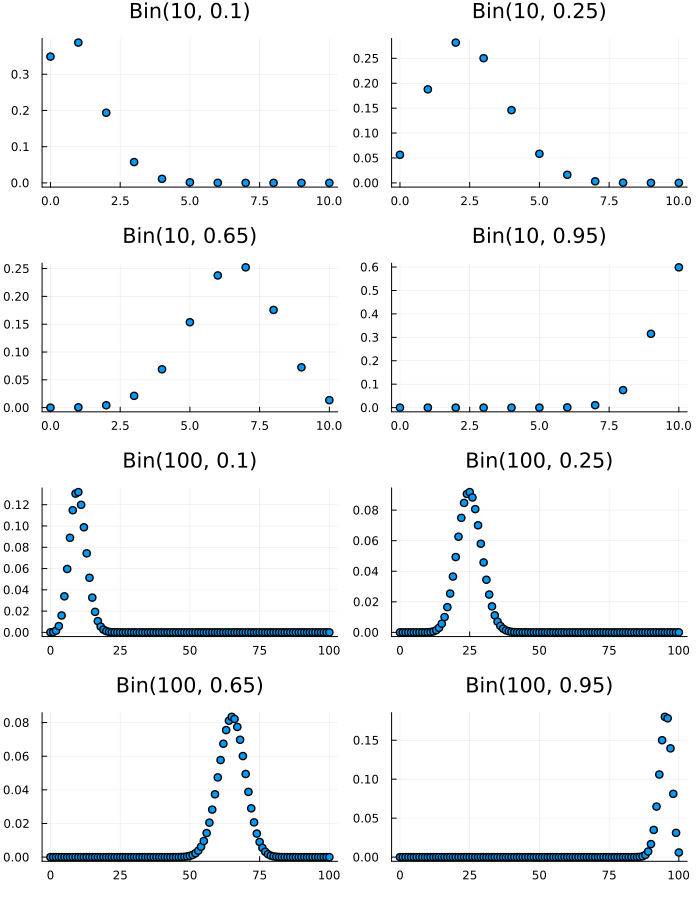

## indicator random variables

an event $A$ is the random variable which equals 1 if $A$ occurs and 0 otherwise. this called an
_indicator random variable_ of an event, denote by $I_A$ or $I(A)$.

## bernoulli

a random variable is said to have the _bernoulli distribution_ with parameter $p$ if $P(X = 1) = p$
and $P(X = 0) = 1 - p$ where $0 < p < 1$. write it as $X \sim Bern(p)$, note `~` is indicate
"is distributed as".

any random variable whose possible values are 0 and 1 has a $Bern(p)$ distribution, with $p$ the
probability of the random variable equaling 1. This number $p$ in $Bern(p)$ is called the parameter
of the distribution, it determines which specific Bernoulli distribution we have. Thus, there is not
just one Bernoulli distribution, but rather a family of Bernoulli distributions, indexed by $p$.

if $X \sim Bern(p)$, then the PMF of $X$ is,

$$\eqalign{
pX(0) = P \lbrace X = 0 \rbrace = 1 - p \\
pX(1) = P \lbrace X = 1 \rbrace = p
}$$

- variate $B: 1, p$
- range $X \in \lbrace 0, 1 \rbrace$
- parameter $p$, bernoulli probability parameter, $0 \lt p \lt 1$

An experiment that can result in either a "success" or a "failure" (but not both) is called a
Bernoulli trial. A Bernoulli random variable can be thought of as the _indicator of success_ in a
Bernoulli trial: it equals 1 if success occurs and 0 if failure occurs in the trial.

## binomial

Suppose that $n$ _independent_ Bernoulli trials are performed, each with the same success probability $p$.
Let $X$ be the number of successes. The distribution of $X$ is called the Binomial distribution with
parameters $n$ and $p$. We write $X \sim Bin(n, p)$ to mean that $X$ has the Binomial distribution
with parameters $n$ and $p$, where $n$ is a positive integer and $0 \lt p \lt 1$.

**Here it is clear that $Bern(p)$ is the same distribution as $Bin(1, p)$ the Bernoulli is a special
case of the Binomial.**

If $X \sim Bin(n, p)$, then the PMF of $X$ is,

$$P(X = k) = {n \choose k} {p^k} {(1 - p)^{n - k}}$$

for $k=0, 1, ..., n$ and $P(X = k) = 0$ otherwise.

For a fixed number of trials $n$, $X$ tends to be larger when the success probability is high and lower when
the success probability is low, as we would expect from the story of the Binomial distribution. Also recall
that in any PMF plot, the sum of the heights of the vertical bars must be 1.

Let $X \sim Bin(n, p)$, and $q = 1 - p$ (we often use $q$ to denote the failure probability of a Bernoulli 
trial). Then $n - X \sim Bin(n, q)$.

- variate $B: n, p$
- range $0 \leq k \leq n,$ $k$ an integer
- parameter $n$, the bernoulli trial parameter (a positive integer), $p$, the bernoulli probability parameter

expected value,

$$\eqalign{
E(X) &= {{\sum}_{x=0}^n}{xP(X=x)} \\
\because P(X=x) = {{n \choose k}{p^k(1-p)^{n-k}}} \\
     &= {\sum_{k=0}^n}{k{n \choose k}{p^k(1-p)^{n-k}}} \\
\\
\because {n \choose k} = {n \over k}{{n-1} \choose {k-1}} \\
\\
\because k=0, {k{n \choose k}{p^k(1-p)^{n-k}}} = 0, \\
     &= n{\sum_{k=1}^n}{{{n-1} \choose {k-1}}{p^k}{(1-p)^{n-k}}} \\
     &= np{\sum_{k=1}^n}{{{n-1} \choose {k-1}}{p^{k-1}}{(1-p)^{(n-1)-(k-1)}}} \\
n-1 = m, k-1 = j \\
     &= np{\sum_{j=0}^m}{{{m} \choose {j}}{p^{j}}{(1-p)^{(m)-(j)}}} \\
{\sum_{j=0}^m}{{{m} \choose {j}}{p^{j}}{(1-p)^{(m)-(j)}}} = 1, \because \sum PMF = 1 \\
E(X) &= np
}$$

variance,

### corollary

Let $X \sim Bin(n, p)$ with $p = {1 \over 2}$ and $n$ even. Then the distribution of $X$ is symmetric about $n=2$, 
in the sense that $P(X = {n \over 2} + j) = P(X = {n \over 2} - j)$ for all non-negative integers j.

## hyper-geometric

Consider an urn with $w$ white balls and $b$ black balls. We draw $n$ balls out of the urn at random without 
replacement, such that all ${{w+b} \choose n}$ samples are equally likely. Let $X$ be the number of white balls in
the sample. Then $X$ is said to have the _Hyper-geometric distribution_ with parameters $w, b,$ and $n$, we denote
this by $X \sim HGeom(w, b, n)$.

If $X \sim HGeom(w, b, n)$, then the PMF of $X$ is,

$$P(X = k) = {{{w \choose k}{b \choose {n-k}}} \over {{w+b} \choose n}}$$

for integers $k$ satisfying $0 \leq k \leq w$ and $0 \leq {n-k} \leq$, and $P(X=k) = 0$ otherwise.

The essential structure of the Hyper-geometric story is that items in a population are classified using two
sets of tags: in the urn story, each ball is either white or black (this is the first set of tags), and each 
ball is either sampled or not sampled (this is the second set of tags). Furthermore, at least one of these 
sets of tags is assigned completely at random (in the urn story, the balls are sampled randomly, with all 
sets of the correct size equally likely). Then $X \sim HGeom(w, b, n)$ represents the number of twice-tagged
items: in the urn story, balls that are both white and sampled.

The $HGeom(w, b, n)$ and $HGeom(n, w + b - n, w)$ distributions are identical. That is, if $X \sim HGeom(w, b, n)$ 
and $Y \sim HGeom(n, w + b - n, w)$, then X and Y have the same distribution.

more general version of hyper-geometric,

$N = w + b$, $X$ are success or one labeled section of the population, $k$ is the number of success, 
$n$ sample size,

$$P(X = k) = {{{X \choose k}{{N - X} \choose {n - k}}} \over {N \choose n}}$$

expected value,

$$\eqalign{
E(X) &= {{\sum}_{x=0}^n}{xP(X=x)} \\
\because P(X=x) = {{{w \choose x}{b \choose {n-x}}} \over {{w+b} \choose n}} \\
     &= {\sum_{k=0}^w}{k}{{{w \choose k}{b \choose {n-k}}} \over {{w+b} \choose n}} \\
\\
\because {k}{w \choose k} = {w}{{w-1} \choose {k-1}}, {{w+b} \choose {n}} = {{w+b} \over n}{{w+b-1} \choose {n-1}}\\
\because k=0, {k}{{{w \choose k}{b \choose {n-k}}} \over {{w+b} \choose n}} = 0 \\
     &= {{nw} \over {w+b}}{\sum_{k=1}^w}{{{{w-1} \choose {k-1}}{b \choose {n-k}}} \over {{w+b} \choose n}} \\
\\
\text{let } k - 1 = j, w - 1 = t, n - 1 = l \\
     &= {{{nw} \over {w+b}}{\sum_{j=0}^t}{{{t \choose j}{b \choose {l-j}}} \over {{t+b} \choose l}}} \\
\because {{\sum_{j=0}^t}{HGeom(t, b, l)}} = 1, \\
E(X) &= {{nw} \over {w+b}}
}$$

variance,

### connection between binomial and hyper-geometric

we can get from the Binomial to the Hyper-geometric by conditioning, and we can get from the Hyper-geometric 
to the Binomial by taking a limit.

for example,

A scientist wishes to study whether women or men are more likely to have a certain disease, or whether they 
are equally likely. A random sample of $n$ women and $m$ men is gathered, and each person is tested for the disease 
(assume for this problem that the test is completely accurate). The numbers of women and men in the sample 
who have the disease are $X$ and $Y$ respectively, with $X \sim Bin(n, p_1)$ and $Y \sim Bin(m, p_2)$, independently. 
Here $p_1$ and $p_2$ are unknown, and we are interested in testing whether $p1 = p2$, suppose that $X + Y = r$,

|            | women | men       | total     |
|------------|-------|-----------|-----------|
| disease    | x     | r - x     | r         |
| no disease | n - x | m - r + x | n + m - r |
| total      | n     | m         | n + m     |

the condition here is $X + Y = r$ (number of men and women found with disease),

$$\eqalign{
P(X = x | X + Y = r) &= {{{P(X + Y = r | X = x)}{P(X = x)}} \over {P(X + Y = r)}} \\
\\
\because {P(X + Y = r | X = x)} = {P(Y = r - x)} \\
                     &= {{{P(Y = r - x)}{P(X = x)}} \over {P(X + Y = r)}}
}$$

${P(X + Y = r | X = x)} = {P(Y = r - x)}$ is justified by the independence of $X$ and $Y$ . Assuming the null 
hypothesis and letting $p = p1 = p2$, we have $X \sim Bin(n, p)$ and $Y \sim Bin(m, p)$, independently, so 
$X + Y \sim Bin(n + m, p)$.

$$\eqalign{
P(X = x | X + Y = r) &= {{{m \choose {r-x}}{p^{r-x}}{{(1 - p)}^{m-r+x}}{n \choose x}{p^x}{(1 - p)^{n-x}}} 
                        \over {{{n+m} \choose r}{p^r}{(1 - p)^{n+m-r}}}}
                     &= {{{n \choose x}{m \choose {r-x}}} \over {{n+m} \choose {r}}}
}$$

So the conditional distribution of $X$ is Hyper-geometric with parameters $n, m, r$:

under the null hypothesis, the set of diseased people is equally likely to be any set of $r$ people. Thus, 
conditional on $X + Y = r$, $X$ represents the number of women among the $r$ diseased individuals, which 
is distributed $HGeom(n, m, r)$.

An interesting fact, which turns out to be useful in statistics, is that the conditional distribution of $X$ does
not depend on $p$: unconditionally, $X \sim Bin(n, p)$, but $p$ disappears from the parameters of the conditional 
distribution! This makes sense upon reflection, since once we know $X + Y = r$, we can work directly with the fact
that we have a population with $r$ diseased and $n + m - r$ healthy people, without worrying about the value of $p$ 
that originally generated the population.

## discrete uniform

Let $C$ be a finite, nonempty set of numbers. Choose one of these numbers uniformly at random (i.e., all 
values in $C$ are equally likely). Call the chosen number $X$. Then $X$ is said to have the Discrete
Uniform distribution with parameter $C$; we denote this by $X \sim DUnif(C)$.

the PMF of $X \sim DUnif(C)$ is,

$$P(X = x) = {1 \over {\lvert C \rvert}}$$

expected value,

variance,

## geo-metric

Consider a sequence of independent Bernoulli trials, each with the same success probability $p \in (0, 1)$, with 
trials performed until a success occurs. Let $X$ be the number of failures before the first successful trial. 
Then $X$ has the Geometric distribution with parameter $p$; we denote this by $X \sim Geom(p)$.

To get the Geometric PMF from the story, imagine the Bernoulli trials as a string of 0's (failures) ending in a 
single 1 (success). Each 0 has probability $q = 1 - p$ and the final 1 has probability $p$, so a string of $k$ 
failures followed by one success has probability ${(1 - p)^k}p$.

$$P(X = k) = {(1 - p)^k}p$$
for $k = 0, 1, 2, ... ,$.

expected value,

$$\eqalign{
E(X) &= {\sum_{k=0}^\infty}{k{(1-p)^k}p} \\
}$$

where $q = 1 - p$ This sum looks unpleasant; it's not a geometric series because of the extra $k$ multiplying 
each term. But we notice that each term looks similar to $kq^{k-1}$ the derivative of $q^k$,

$$\eqalign{
{\sum_{k=0}^\infty}{(1-p)^k} &= {1 \over {1 - (1 - p)}} = {1 \over p} \\
{\sum_{k=0}^\infty}{k(1-p)^{k-1}} &= {1 \over p^2} \\
\\
     &= {\sum_{k=0}^\infty}{k{(1-p)}{(1-p)^{k-1}}p} \\
     &= {p(1-p)}{\sum_{k=0}^\infty}{k{(1-p)^{k-1}}} \\
\because {\sum_{k=0}^\infty}{k(1-p)^{k-1}} = {1 \over p^2} \\
     &= {{p(1-p)} \over {p^2}} \\
E(X) &= {(1-p) \over {p}}
}$$

variance,

## poisson

a random variable $X$ has the _poisson distribution_ with parameter $\lambda$, where $\lambda > 0$, if the PMF of
$X$ is,

$$P(X=k) = {{e^{-\lambda}{\lambda^k}} \over {k!}}, k=0,1,2,...$$

We write this as $X \sim Pois(\lambda)$.

expected value,

$$\eqalign{
E(X) &= {{\sum}_{x=0}^n}{xP(X=x)} \\
     &= {e^{-\lambda}}{{\sum}_{k=0}^\infty}{k{{{\lambda}^k} \over {k!}}} \\
     &= {e^{-\lambda}}{{\sum}_{k=1}^\infty}{k{{{\lambda}^k} \over {k!}}} \\
     &= {{\lambda}e^{-\lambda}}{{\sum}_{k=1}^\infty}{{{{\lambda}^{k-1}} \over {{k-1}!}}} \\
     &= {\lambda}{e^{-\lambda}}{e^{\lambda}}
     &= \lambda
}$$

First we dropped the $k = 0$ term because it was 0. Then we took a $\lambda$ out of the sum so that what was left 
inside was just the Taylor series for $e^{\lambda}$.

The Poisson distribution is often used in situations where we are counting the number of successes in a particular
region or interval of time, and there are a large number of trials, each with a small probability of success. The 
parameter $\lambda$ is interpreted as the rate of occurrence of these rare events.

## connections between poisson and binomial

The Poisson and Binomial distributions are closely connected, and their relationship is exactly parallel to the 
relationship between the Binomial and Hyper-geometric distributions. we can get from the Poisson to the Binomial 
by conditioning, and we can get from the Binomial to the Poisson by _taking a limit_.

If $X \sim Pois({\lambda}_1)$, $Y \sim Pois({\lambda}_2)$, and $X$ is independent of $Y$, then 
$X + Y \sim Pois({\lambda}_1 + {\lambda}_2)$.

If $X \sim Pois({\lambda}_1)$, $Y \sim Pois({\lambda}_2)$, and $X$ is independent of $Y$, then the conditional 
distribution of $X$ given $X + Y = n$ is $Bin(n, {{{\lambda}_1} \over {({\lambda}_1 + {\lambda}_2)}})$.