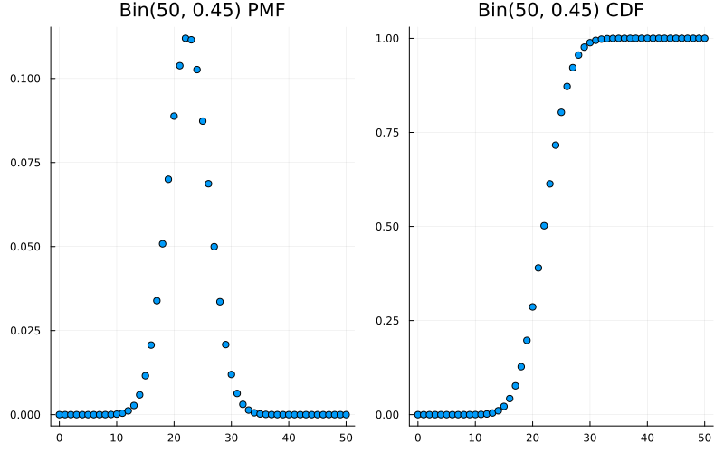

## random variable

let's assume a game of cards, we may be very interested in how much wealth each gambler has at
any particular time,

we could make up notation like letting $A_{jk}$ be the event that gambler $A$ has exactly $j$
dollars after $k$ rounds, and similarly defining an event $B_{jk}$ for gambler $B$, for all
$j$ and $k$. (in $r$ rounds of play)

- event $A_{jk}$ : number of dollars $A$ has after $k$ rounds of playing
- event $B_{jk}$ : number of dollars $B$ has after $k$ rounds of playing

also we interested in wealth difference between two players and time duration they played.

Instead of having convoluted notation that obscures how the quantities of interest
are related,

> "Let $X_k$ be the wealth of gambler $A$ after $k$ rounds. Then $Y_k = N - X_k$
> is the wealth of gambler $B$ after $k$ rounds (where N is the fixed total wealth);
> $X_k - Y_k = 2.X_k - N$ is the difference in wealth after $k$ rounds; ${c_k}X_k$
> is the wealth of gambler $A$ in euros after $k$ rounds, where ${c_k}$ is the euros
> per dollar exchange rate after $k$ rounds; and the duration is
> R = min $\lbrace n : X_n = 0 or Y_n = 0 \rbrace$"

The notion of a random variable will allow us to do exactly this!

> "_a random variable is a variable that takes on random values_"

but such a feeble attempt at a definition fails to say where the randomness come from. Nor
does it help us to derive properties of random variables.

$$x^2 + y^2 = 1$$

A random variable maps the sample space into the real line. The random variable $X$ depicted
here is defined on a sample space with 6 elements, and has possible values 0, 1, and 4. The
randomness comes from choosing a random pebble according to the probability function $P$ for
the sample space.

**_Given an experiment with sample space S, a random variable is a function from the sample
space S to the real numbers R._**

Thus, a random variable $X$ assigns a numerical value $X(s)$ to each possible outcome $s$ of the
experiment. The randomness comes from the fact that we have a random experiment, with probabilities
described by the probability function P. the mapping itself is deterministic.

for example,

Consider an experiment where we toss a fair coin twice. The sample space consists of four possible
outcomes: $S = {HH, HT, TH, TT}$, let's consider some random variables,

- let $X$ (random variable) be the number of heads, possible outcomes of this random variable are
  0, 1 ,2 and mapping will like,

$$X(HH) = 2, X(HT) = X(TH) = 1, X(TT) = 0$$

- let $Y$ be the number of tails, in terms of $X$,

$$Y = 2 - X \text{ in other words, } Y(s) = 2 - X(s)$$

- Let $I$ be 1 if the first toss lands Heads and 0 otherwise. Then $I$ assigns the value 1 to the outcomes
  $HH$ and $HT$ and 0 to the outcomes $TH$ and $TT$. This random variable is an example of what is called
  an indicator random variable since it indicates whether the first toss lands Heads, using 1 to mean
  "yes" and 0 to mean "no"

We can also encode the sample space as ${(1, 1), (1, 0), (0, 1), (0, 0)}$, where 1 is the code for Heads and
0 is the code for Tails. Then we can give explicit formulas for $X, Y, I$:

$$\eqalign{X_{(s_1, s_2)} &= s_1 + s_2 \\
Y_{(s_1, s_2)} &= 2 - s_1 - s_2 \\
I_{(s_1, s_2)} &= s_1
}$$

## variate

A variate is a generalization of the idea of a random variable and has similar probabilistic properties
but is defined without reference to a particular type of probabilistic experiment. A variate is the set
of all random variables that obey a given probabilistic law.

## cumulative distribution functions

The cumulative distribution function (CDF) of a random variable $X$ is the function $F_X$ given by
$F_X(x) = P(X \leq x)$. When there is no risk of ambiguity, we sometimes drop the subscript(x) and
just write F (or some other letter) for a CDF. CDF is the probability function that $X$ will take
a value less than or equal to $x$.

Any CDF $F$ has the following properties,

- increasing: if $x_1 \leq x_2$, then $F(x_1) \leq F(x_2)$
- right continues: CDF is continuous except possibly for having some jumps. Wherever there is a jump,
  the CDF is continuous from the right. That is, for any $a$, we have,

$$F(a) = {\lim}_{x \to a^{+} F(x)}$$

- convergence to 0 and 1 in the limit,

$${\lim}_{x \to -\infty} F(x) = 0 \text{ and } {\lim}_{x \to \infty} F(x) = 1$$

## function of random variables

That is, if $X$ is a random variable, then $X^2$, $e^X$, and $sin(X)$ are also random variables, as is 
$g(X)$ for any function $g : R \to R$.

if we want, apply the same function $g$ to all the numbers inside the pebbles. Instead of the numbers 
$X(s_1)$ through $X(s_6)$, we now have the numbers $g(X(s_1))$ through $g(X(s_6))$, which gives a new 
mapping from sample outcomes to real numbers we've created a new random variable, $g(X)$.

_For an experiment with sample space $S$, a random variable $X$, and a function $g : R \to R, g(X)$ is 
the random variable that maps $s$ to $g(X(s))$ for all $s \in S$._

This suggests a strategy for finding the PMF of a random variable with an unfamiliar distribution:
try to express the random variable as a one-to-one function of a random variable with a known
distribution.

## expected value

The definition of expectation for a discrete random variable is inspired by the weighted mean of a list of 
numbers, with weights given by probabilities. The expected value (also called the expectation or mean) of 
a discrete random variable $X$ whose distinct possible values are $x_1, x_2, ...$ is define by,

$$E(X) = {\sum}_{j=1}^\infty {P(X = x_j)}$$

$x_j$ is a value that random variable can get $P(X = x)$ is the PMF at $x$.

if $X$ and $Y$ are discrete random variable with the same distribution, then $E(X) = E(Y)$. The converse of 
the proposition is false since the expected value is just a one number summary, not nearly enough to specify 
the entire distribution. it's a measure of where the "center" is but does not determine, for example, how 
spread out the distribution is or how likely the random variable is to be positive.

### linearity of expectation

The most important property of expectation is linearity: the expected value of a sum of random variable is 
the sum of the individual expected values.

For any random variables X, Y and any constant c,

$$\eqalign{
E(X + Y) &= E(X) + E(Y), \\
   E(cX) &= cE(X)
}$$

The second equation says that we can take out constant factors from an expectation, this is both intuitively 
reasonable and easily verified from the definition. The first equation, $E(X + Y) = E(X) + E(Y)$, also 
seems reasonable when $X$ and $Y$ are independent. What may be surprising is that it holds even if $X$ and $Y$
are dependent! To build intuition for this, consider the extreme case where $X$ always equals $Y$. Then
$X + Y = 2X$, and both sides of $E(X + Y ) = E(X) + E(Y)$ are equal to $2E(X)$, so linearity still holds 
even in the most extreme case of dependence.

This insight, that averages can be calculated in two ways, ungrouped or grouped is all that is needed to 
prove linearity.

## law of the unconscious statistics

$E(g(X))$ does not equal $g(E(X))$ in general if $g$ is not linear. So how do we correctly calculate $E(g(X))$? Since
$g(X)$ is an random variable, one way is to first find the distribution of $g(X)$ and then use the definition
of expectation. Perhaps surprisingly, it turns out that it is possible to find $E(g(X))$ directly using the 
distribution of $X$, without first having to find the distribution of $g(X)$. This is done using the law of 
the unconscious statistician (LOTUS).

$$E(g(X)) = {\sum_{x}}{g(x)P(X=x)}$$

## variance

Like expected value, variance is a single-number summary of the distribution of a random variable. While the 
expected value tells us the center of mass of a distribution, the variance tells us how spread out the 
distribution is.

the _variance_ of a discrete random variable $X$ is,
$$Var(X) = E(X - EX)^2$$

recall that when we write $E(X - EX)^2$, we mean the expectation of the random variable $(X - EX)^2$, 
not $(E(X - EX))^2$ (which is 0 by linearity).

for any random variable $X$,
$$Var(X) = E(X^2) - (EX)^2$$